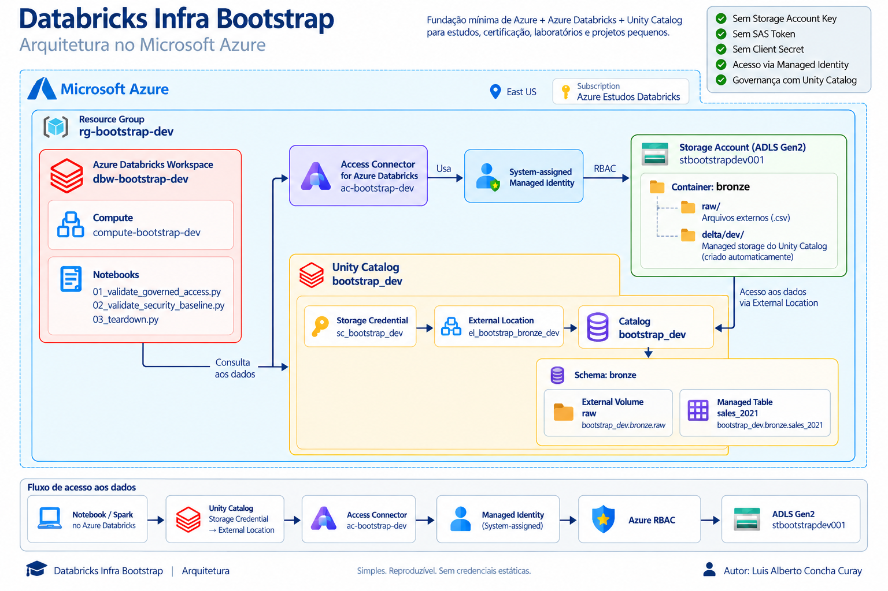

# Databricks Infra Bootstrap

<p align="left">
  
  
  
  
  
  
</p>

Bootstrap reproduzível para criar uma fundação mínima de **Azure + Azure Databricks + Unity Catalog**, voltada a estudos, certificação, laboratórios e projetos pequenos.

A proposta é simples: manter este README aberto ao lado do Azure Portal e do Azure Databricks e executar o ambiente **passo a passo**, sem depender de conhecimento implícito sobre onde encontrar cada configuração.

<p align="center">
  
</p>

## Arquitetura

``` text
Azure
rg-bootstrap-dev
├── stbootstrapdev<suffix>
│   └── bronze/
│       ├── raw/
│       └── delta/dev/
├── ac-bootstrap-dev
└── dbw-bootstrap-dev

Unity Catalog
sc_bootstrap_dev
        ↓
el_bootstrap_bronze_dev
        ↓
bootstrap_dev
└── bronze
    ├── raw          External Volume
    └── sales_2021   Managed Table de validação
```

Acesso ao ADLS:

``` text
Unity Catalog
→ Storage Credential
→ Access Connector
→ System-assigned Managed Identity
→ Azure RBAC
→ ADLS Gen2
```

Não são utilizadas Storage Account Key, SAS Token ou client secret para acesso ao ADLS.

## Estrutura

``` text
databricks-infra-bootstrap/
├── images/
│   ├── arquitetura_azure_databricks_bootstrap.png
├── notebooks/
│   ├── 01_validate_governed_access.py
│   ├── 02_validate_security_baseline.py
│   └── 03_teardown.py
├── sample-data/
│   └── sales_2021.csv
├── .gitignore
└── README.md
```

O bootstrap cobre a infraestrutura e sua validação. Silver/Gold,pipelines de negócio, Lakeflow Jobs, DABs, CI/CD, dashboards, VNet injection, Private Endpoint, Private DNS e Azure Firewall não fazem parte do baseline.

---

## 1. Convenções

Valores usados neste tutorial:

``` text
<project> = bootstrap
<env>     = dev
<region>  = East US
<suffix>  = 001
```

``` text
  ----------------------------------------------------------------------------------
  Recurso                 Padrão                        Exemplo
  ----------------------- ----------------------------- ----------------------------
  Resource Group          `rg-<project>-<env>`          `rg-bootstrap-dev`

  Storage Account         `st<project><env><suffix>`    `stbootstrapdev001`

  Databricks Workspace    `dbw-<project>-<env>`         `dbw-bootstrap-dev`

  Access Connector        `ac-<project>-<env>`          `ac-bootstrap-dev`

  Storage Credential      `sc_<project>_<env>`          `sc_bootstrap_dev`

  External Location       `el_<project>_bronze_<env>`   `el_bootstrap_bronze_dev`

  Catalog                 `<project>_<env>`             `bootstrap_dev`

  Schema                  `bronze`                      `bronze`

  External Volume         `<catalog>.bronze.raw`        `bootstrap_dev.bronze.raw`

  Compute                 `compute-<project>-<env>`     `compute-bootstrap-dev`
  ----------------------------------------------------------------------------------
``` 
> O nome do Storage Account deve ser globalmente único. O `<suffix>` permite variar o nome entre execuções.

> **Nova execução:** se um teste anterior não concluiu o teardown dos objetos do Unity Catalog, nomes como `Storage Credential e External Location` podem continuar indisponíveis enquanto existirem dependências retidas. Nesse caso, não utilize `FORCE` como procedimento padrão. Use um sufixo temporário nos objetos conflitantes durante a nova execução.
>
> Exemplo: `sc_bootstrap_dev_001` e `el_bootstrap_bronze_dev_001`.


---

## 2. Resource Group

No **Azure Portal**, utilizar a barra de pesquisa, procurar por `Resource groups`, acessar o serviço e clicar em `Create`.

Configurar:

-   Aba **Basics**:
    -   Subscription: `<sua-subscription>`
    -   Resource group: `rg-<project>-<env>`
    -   Region: `East US`
-   Aba **Tags**: opcional; manter sem tags caso não exista uma política específica
-   `Review + Create` → `Create`

Exemplo criado pelo tutorial:

``` text
rg-bootstrap-dev
```

> `East US` é a região de referência deste bootstrap, não uma exigência universal. Sempre que possível, mantenha os recursos do laboratório na mesma região.

---

## 3. Storage Account --- ADLS Gen2

No **Azure Portal**, pesquisar por `Storage accounts`, acessar o serviço e clicar em `Create`.

Configurar:

-   Aba **Basics**:
    -   Subscription: `<sua-subscription>`
    -   Resource group: `rg-<project>-<env>`
    -   Storage account name: `st<project><env><suffix>`
    -   Region: `East US`
    -   Primary service: `Azure Blob Storage or Azure Data Lake Storage`
    -   Performance: `Standard`
    -   Redundancy: `Locally-redundant storage (LRS)`
-   Aba **Advanced**:
    -   Hierarchical namespace: `Enabled`
    -   demais opções: manter o default
-   Aba **Networking**:
    -   Public network access: `Enabled`
    -   Network access: `Enable public access from all networks`
    -   demais opções: manter o default
-   Demais abas: manter as opções default
-   `Review + Create` → `Create`

Exemplo:

``` text
stbootstrapdev001
```

**Por quê?** `StorageV2 + Hierarchical Namespace` fornece a base do ADLS Gen2.\[1\] O bootstrap usa LRS por ser um ambiente pequeno e descartável; workloads com requisitos maiores de disponibilidade devem reavaliar a redundância.

Após o deployment, abrir o Storage Account criado e criar o container:

-   `Data storage`
    -   `Containers`
        -   `+ Container`
            -   Name: `bronze`
            -   Anonymous access level: `Private (no anonymous access)`
            -   `Create`

A estrutura física usada pelo bootstrap será:

``` text
bronze/
├── raw/
```

Não é necessário criar `silver` ou `gold`.

> `raw/` receberá os arquivos externos. O caminho `delta/dev/` será criado posteriormente como parte do managed storage do Catalog. Não precisamos criá-lo nem manipulá-lo manualmente, pois sua estrutura será administrada pelo Unity Catalog, incluindo o diretório interno `__unitystorage`.[2]

---

## 4. Azure Databricks Workspace

No **Azure Portal**, pesquisar por `Azure Databricks`, acessar o serviço e clicar em `Create`.

Configurar:

-   Aba **Basics**:
    -   Subscription: `<sua-subscription>`
    -   Resource group: `rg-<project>-<env>`
    -   Workspace name: `dbw-<project>-<env>`
    -   Region: `East US`
    -   Pricing Tier: `Premium`
    -   Workspace type: `Hybrid`
-   Aba **Networking**:
    -   Deploy Azure Databricks workspace with Secure Cluster Connectivity (No Public IP): `Yes`
    -   Deploy Azure Databricks workspace in your own Virtual Network (VNet): `No`
    -   demais opções: manter o default
-   Demais abas: manter as opções default
-   `Review + Create` → `Create`

Exemplo:

``` text
dbw-bootstrap-dev
```

Após a criação:

-   Abrir `dbw-<project>-<env>`
    -   clicar em `Launch Workspace`

> `No Public IP = Yes` habilita Secure Cluster Connectivity para o baseline de classic compute.\[3\] Isso não significa necessariamente ausência de outbound para Internet no modelo de rede gerenciada.

---

## 5. Access Connector for Azure Databricks

No **Azure Portal**, pesquisar por `Access Connector for Azure Databricks`, acessar o serviço e clicar em `Create`.

Configurar:

-   Aba **Basics**:
    -   Subscription: `<sua-subscription>`
    -   Resource group: `rg-<project>-<env>`
    -   Name: `ac-<project>-<env>`
    -   Region: `East US`
-   Aba **Tags**: manter as opções default
-   Aba **Managed Identity**:
    -   utilizar a `System-assigned Managed Identity`
    -   não adicionar `User-assigned Managed Identity`
-   `Review + Create` → `Create`

Exemplo:

``` text
ac-bootstrap-dev
```

Após a criação, copiar o **Access Connector ID**:

-   Abrir `ac-<project>-<env>`
    -   `Settings`
        -   `Properties`
            -   `Essentials`
                -   copiar `ID`

> Guarde o `ID`. Ele será utilizado na criação da Storage Credential. Neste bootstrap o Access Connector usa identidade gerenciada e permanece na mesma região do Storage Account.\[4\]

---

## 6. Azure RBAC

Os **file events** utilizados pelo Unity Catalog dependem do Azure Event Grid. Antes de configurar as roles, confirmar que o resource provider correspondente está registrado na Subscription.

No **Azure Portal**, navegar até:

- `Subscriptions`
  - selecionar `<sua-subscription>`
    - `Settings`
      - `Resource providers`

Pesquisar por:

```text
Microsoft.EventGrid
```

Confirmar:

```text
Status = Registered
```

Se o status estiver como `NotRegistered`, selecionar `Microsoft.EventGrid`, clicar em `Register` e aguardar até que o status seja alterado para `Registered`.

> Essa configuração é realizada no nível da **Subscription** e normalmente precisa ser feita apenas uma vez. Se `Microsoft.EventGrid` já estiver como `Registered`, nenhuma alteração é necessária.

### Configurar as roles

No **Azure Portal**, abrir o Storage Account `st<project><env><suffix>`.

Navegar até:

- `Access control (IAM)`
  - `+ Add`
    - `Add role assignment`

Configurar:

- Aba **Role**:
  - pesquisar por `Storage Blob Data Contributor`
  - selecionar `Storage Blob Data Contributor`
  - `Next`

- Aba **Members**:
  - Assign access to: `Managed identity`
  - `+ Select members`
    - Subscription: `<sua-subscription>`
    - Managed identity: `Access Connector for Azure Databricks`
    - selecionar `ac-<project>-<env>` (ex.: `ac-bootstrap-dev`)
    - `Select`
  - `Next`

- Aba **Conditions**: não adicionar condição
- `Review + assign`

**Fazer o mesmo com as roles:**

- `Storage Account Contributor`
- `EventGrid EventSubscription Contributor`
- `Storage Queue Data Contributor`

Resultado esperado: o Access Connector possui as quatro roles utilizadas pelo bootstrap para acesso aos dados e provisionamento dos **file events**.

> `Storage Blob Data Contributor` permite ler e gravar os dados. As roles adicionais são utilizadas no provisionamento e consumo da infraestrutura de **file events** (Event Grid + Storage Queue).\[4\]
>
> Se posteriormente a criação da External Location apresentar `File Events Resource Provision`, confirme primeiro que `Microsoft.EventGrid` está `Registered` na Subscription e revise os role assignments e seus respectivos escopos. Não utilize `Force create` como procedimento normal.

---

## 7. Storage Credential

Abrir o **Azure Databricks Workspace**:

-   Azure Portal
    -   abrir `dbw-<project>-<env>`
        -   `Launch Workspace`

No workspace, acessar a área de **Catalog / Unity Catalog** e localizar a criação de **Credentials**.

`Catalog -> Connect -> Credentials -> criar credential`
ou `Catalog -> Create -> Create a credential.` ambas chegam ao modal Create a new credential.

Criar uma Storage Credential com:

-   Name: `sc_<project>_<env>`
-   Credential type: `Azure Managed Identity`
-   Access Connector ID: colar o `ID` copiado no passo 5
-   Advanced Options:
      - Limit to read-only use: deixar desmarcado
-   criar/salvar a credential

Exemplo:

``` text
sc_bootstrap_dev
```

Após a criação, confirmar que `sc_bootstrap_dev` aparece entre as Storage Credentials.

> A Storage Credential define **como o Unity Catalog se autentica** no armazenamento Azure.\[5\] O caminho do ADLS será associado no próximo passo.

---

## 8. External Location

Ainda no **Azure Databricks Workspace**, acessar a área de **Catalog / Unity Catalog** e localizar **External Locations**.

Criar uma External Location:

-   Name: `el_<project>_bronze_<env>`
-   Storage type: `Azure Data Lake Storage`
-   URL: `abfss://bronze@<storage-account>.dfs.core.windows.net/`
-   Storage Credential: `sc_<project>_<env>`
-   File event type: `Automatic`
-   Fallback: `Disabled`
-   criar/salvar a External Location

Exemplo:

``` text
Name:
el_bootstrap_bronze_dev

URL:
abfss://bronze@stbootstrapdev001.dfs.core.windows.net/
```

Executar a opção de validação disponível para a External Location.

Resultado esperado: as verificações disponíveis concluem com sucesso, incluindo o acesso ao storage e a validação dos file events.

Se houver erro, investigar nesta ordem:

``` text
External Location URL
→ Storage Credential
→ Access Connector
→ Managed Identity
→ Azure RBAC
→ Storage Account
```

> A External Location associa uma Storage Credential a um caminho de cloud storage governado pelo Unity Catalog.\[6\] Não adicione roles extras automaticamente quando uma validação falhar.

---

## 9. Catalog e Schema

No **Azure Databricks Workspace**, acessar `Catalog`.

Criar o Catalog:

- `Create`
  - `Create a catalog`
    - Catalog name: `<project>_<env>`
    - Type: `Standard`
    - Storage location:
      - External location: `el_<project>_bronze_<env>`
      - sub/path: `delta/<env>`
    - conferir o caminho `abfss` resolvido pela interface
    - `Create`

Exemplo:

    Catalog name:
    bootstrap_dev

    Type:
    Standard

    External location:
    el_bootstrap_bronze_dev

    sub/path:
    delta/dev

    Managed storage resultante:
    abfss://bronze@stbootstrapdev001.dfs.core.windows.net/delta/dev

> Para definir o managed storage, o criador precisa do privilégio `CREATE MANAGED STORAGE` na External Location correspondente.[7]

Depois, abrir o Catalog criado e criar o Schema:

- abrir `bootstrap_dev`
  - clicar em `Create schema`
    - Schema name: `bronze`
    - Storage location: deixar em branco para herdar o managed storage do Catalog
    - Comment: opcional
    - `Create`

Resultado lógico:

```text
bootstrap_dev
├── bronze
├── default
└── information_schema
```
> Os Schemas `default` e `information_schema` são criados automaticamente com o Catalog. O Schema `bronze` é criado manualmente neste passo e será utilizado pelos objetos do bootstrap.

O caminho definido para o managed storage do Catalog é `bronze/delta/dev/`

O conteúdo físico das managed tables e managed volumes criados nesse escopo é administrado pelo Unity Catalog e não deve ser manipulado diretamente.

**Observações:** 

> No item 3 criamos apenas o container `bronze` e não criamos manualmente o caminho `delta/dev/`. É neste passo que `delta/dev` é definido como managed storage do Catalog por meio do campo `sub/path`. A partir daqui, esse local passa a ser administrado pelo Unity Catalog, que utilizará `__unitystorage` para os objetos managed. Não crie nem manipule manualmente essa estrutura.

> Após a criação, o Databricks pode exibir a janela Catalog created! com as opções View catalog e Configure catalog. Neste bootstrap, selecionar View catalog. As configurações adicionais de permissões, workspace bindings e metadata não fazem parte desta etapa.

---

## 10. External Volume `raw`

No **Azure Databricks Workspace**:

-   `Catalog`
    -   abrir `bootstrap_dev`
        -   abrir Schema `bronze`
            -   criar `Volume`

Na tela `Create a new volume`, configurar:

- Volume name: `raw`
- Volume type: `External volume`
- External location: `el_<project>_bronze_<env>`
- Path: `raw/`
- Catalog: `<project>_<env>`
- Schema: `bronze`
- `Create`

Exemplo:

```text
Volume name:
raw

External location:
el_bootstrap_bronze_dev

Path:
raw/

Catalog:
bootstrap_dev

Schema:
bronze
```

O caminho resultante será:

```text
abfss://bronze@<storage-account>.dfs.core.windows.net/raw/
```

A estrutura fica:

``` text
bronze/
├── raw/          ← External Volume
└── delta/dev/    ← managed storage
```

O acesso lógico aos arquivos será:

``` text
/Volumes/bootstrap_dev/bronze/raw/
```

> Um **Managed Volume** armazena arquivos em uma localização administrada pelo Unity Catalog. Um **External Volume** governa arquivos mantidos em um caminho externo definido por você. Neste bootstrap, `raw` é External porque representa a entrada de arquivos no ADLS.[8]

> Não utilize DBFS mounts (`/mnt/...`). Volumes são a interface governada utilizada pelo bootstrap para arquivos.[8]

Para a validação, fazer upload de:

```text
sample-data/sales_2021.csv
```

O upload pode ser realizado de duas formas:

- pelo **Azure Databricks**, abrindo o External Volume `bootstrap_dev.bronze.raw` e utilizando `Upload to this volume`; ou
- pelo **Azure Portal**, abrindo o Storage Account e navegando até `Containers > bronze > raw`.


Após o upload, o arquivo deverá estar acessível no Databricks por:

```text
/Volumes/bootstrap_dev/bronze/raw/sales_2021.csv
```

e corresponder fisicamente no ADLS Gen2 a:

```text
bronze/raw/sales_2021.csv
```

---

## 11. Compute

No **Azure Databricks Workspace**, acessar `Compute` e clicar em `Create compute`.

Configurar:

-   Compute name: `compute-<project>-<env>`
-   Compute type: classic all-purpose compute
-   Databricks Runtime: `Latest supported LTS`
    -   referência em setembro de 2026: `Databricks Runtime 18 LTS`
-   Access mode: `Dedicated`
-   Single Node: `Enabled`
-   Workers: `0`
-   Node type: selecionar a menor opção compatível disponível
-   Auto termination: `10 minutes`
-   Photon: não é requisito do bootstrap
-   demais opções: manter o default
-   criar o compute

Exemplo:

``` text
compute-bootstrap-dev
```

Aguardar até o compute ficar disponível.

> O compute serve somente para validar a infraestrutura. Single Node é uma escolha proporcional ao arquivo de teste e não uma recomendação para workloads distribuídos.\[9\]

---

## 12. Validação ponta a ponta

No **Azure Databricks Workspace**, importar ou abrir:

```text
notebooks/01_validate_governed_access.py
```

Anexar o notebook ao compute:

```text
compute-bootstrap-dev
```

A validação será executada em etapas. Não avance para a etapa seguinte antes de confirmar o resultado da anterior.

### 12.1 Ler o arquivo pelo External Volume

Executar:

```python
volume_path = "/Volumes/bootstrap_dev/bronze/raw/sales_2021.csv"

df = (
    spark.read
    .option("header", True)
    .option("inferSchema", True)
    .csv(volume_path)
)

display(df)
```

### 12.2 Criar uma managed table

Com o DataFrame `df` criado na etapa anterior, executar:

```python
table_name = "bootstrap_dev.bronze.sales_2021"

(
    df.write
    .format("delta")
    .mode("overwrite")
    .saveAsTable(table_name)
)

print(f"Managed table criada: {table_name}")
```

### 12.3 Consultar a managed table

```sql
SELECT * FROM bootstrap_dev.bronze.sales_2021;
```

### 12.4 Confirmar que a tabela é MANAGED

```sql
DESCRIBE EXTENDED bootstrap_dev.bronze.sales_2021;
```

### 12.5 Observar o managed storage no ADLS Gen2

Depois da criação da managed table, voltar ao **Azure Portal**.

Abrir:

- `st<project><env><suffix>`
  - `Data storage`
    - `Containers`
      - `bronze`
        - `delta`
          - `<env>`

Neste exemplo:

```text
bronze/
└── delta/
    └── dev/
```

Observar a estrutura criada e administrada pelo Unity Catalog, incluindo:

```text
__unitystorage/
```

> Não criar, alterar, mover ou excluir manualmente conteúdo dentro de `__unitystorage`. Managed tables devem ser acessadas pelo namespace do Unity Catalog, como `bootstrap_dev.bronze.sales_2021`, e não por seus caminhos físicos internos.[2]


A validação ponta a ponta somente está concluída quando:

- o CSV puder ser lido pelo External Volume;
- as `10` linhas forem carregadas pelo Spark;
- a managed table for criada;
- a consulta SQL retornar os registros;
- `DESCRIBE EXTENDED` confirmar `Type = MANAGED`;
- a estrutura administrada pelo Unity Catalog puder ser observada em `bronze/delta/dev/`.

------------------------------------------------------------------------

## 13. Segurança do baseline

Para validar os objetos de governança configurados no Unity Catalog, fazer upload de:

```text
notebooks/02_validate_security_baseline.py
```

para o **Azure Databricks Workspace**.

Anexar o notebook ao compute:

```text
compute-<project>-<env>
```

Exemplo:

```text
compute-bootstrap-dev
```

Antes de executar, ajustar no notebook os nomes da `Storage Credential` e da `External Location` para os utilizados na execução atual do bootstrap.

Executar as células sequencialmente. O notebook valida:

1. a existência da Storage Credential;
2. o uso de Azure Managed Identity e do Access Connector correspondente;
3. a associação entre External Location, Storage Credential e Storage Account;
4. os grants explícitos da External Location;
5. os grants explícitos da Storage Credential.

As demais configurações de segurança relacionadas à infraestrutura Azure são verificadas durante os respectivos passos deste tutorial.

O laboratório termina com:

```text
Controle                             Decisão
-----------------------------------  ------------------
System-assigned Managed Identity     Sim
Azure RBAC                           Sim
Unity Catalog                        Sim
Storage Account Key                  Não
SAS Token                            Não
Client Secret para ADLS              Não
Anonymous Blob Access                Disabled
Minimum TLS                          1.2
Storage Public Network               Enabled
No Public IP compute                 Sim
Private Endpoint / VNet injection    Fora do baseline
```

> `Public Network Access = Enabled` não significa acesso anônimo. A rede permite alcançar o endpoint; autenticação e autorização continuam sendo realizadas por Managed Identity, RBAC e Unity Catalog.

---

## 14. Teardown

O teardown é realizado em duas etapas:

1. remover os objetos do Unity Catalog usando o notebook `03_teardown.py`;
2. remover a infraestrutura Azure pelo Resource Group.

### 14.1. Teardown no Azure Databricks

No **Azure Databricks Workspace**, importar ou abrir:

```text
notebooks/03_teardown.py
```

Anexar o notebook ao compute:

```text
compute-<project>-<env>
```

Exemplo:

```text
compute-bootstrap-dev
```

Executar as células **sequencialmente**, seguindo as validações do próprio notebook.

Antes das exclusões, o notebook verifica o período de recuperação do Catalog, configura:

```sql
RETAIN DROPPED TO 0 HOURS
```

e confirma `Recovery Period Hours = 0` no Catalog e no Schema `bronze`.

Essa configuração é adequada para este bootstrap por se tratar de um ambiente descartável de laboratório. O período padrão de recuperação de managed tables é de 7 dias; `0 HOURS` desabilita o `UNDROP` para tabelas removidas após essa configuração. O recurso está em Public Preview.\[10\]

O teardown segue esta ordem:

1. verificar e configurar `RETAIN DROPPED TO 0 HOURS`;
2. remover a managed table `<catalog>.bronze.sales_2021`;
3. remover o External Volume `<catalog>.bronze.raw`;
4. remover o Schema `bronze`;
5. remover o Schema `default`;
6. remover o Catalog;
7. remover a External Location;
8. remover a Storage Credential.

O notebook valida as remoções entre as etapas antes de prosseguir.

> **Atenção:** mesmo com `Recovery Period Hours = 0`, uma managed table removida pode permanecer temporariamente como dependência interna e impedir a exclusão da External Location. Nesse caso, não utilize `FORCE` como procedimento padrão. Aguarde a conclusão da limpeza interna e tente novamente. A Storage Credential também permanecerá protegida enquanto a External Location depender dela.\[10\]

Não exclua nem manipule manualmente diretórios internos `__unitystorage`.

### 14.2. Teardown no Azure

Após executar o teardown no Azure Databricks, acessar o **Azure Portal** e pesquisar por:

```text
Resource groups
```

Depois:

- abrir `rg-<project>-<env>`;
- conferir se o Resource Group contém somente recursos deste bootstrap;
- clicar em `Delete resource group`;
- informar o nome do Resource Group quando solicitado;
- confirmar a exclusão.

Exemplo:

```text
rg-bootstrap-dev
```

A exclusão do Resource Group remove os recursos Azure criados pelo bootstrap, incluindo:

```text
Resource Group
├── Storage Account
├── Azure Databricks Workspace
├── Access Connector
└── recursos auxiliares associados
```

Recursos auxiliares, como o **Event Grid System Topic** criado durante a configuração de file events, também podem aparecer no Resource Group.

Antes de confirmar a exclusão, verifique novamente se nenhum recurso externo ao bootstrap está presente no Resource Group.

### Nova execução após o teardown

Não dependa da reutilização imediata dos mesmos nomes. Recursos Azure com requisito de unicidade e objetos do Unity Catalog ainda sujeitos a dependências podem permanecer temporariamente indisponíveis.

Para recursos Azure globalmente únicos, altere `<suffix>` quando necessário:

```text
stbootstrapdev005
→
stbootstrapdev006
```

Se objetos do Unity Catalog de uma execução anterior ainda estiverem bloqueados por dependências, não utilize `FORCE` como procedimento padrão. Utilize temporariamente o mesmo sufixo da nova execução nos objetos conflitantes.

Exemplo:

```text
sc_bootstrap_dev_006
el_bootstrap_bronze_dev_006
```

A convenção oficial permanece:

```text
sc_<project>_<env>
el_<project>_bronze_<env>
```

O sufixo adicional é apenas uma exceção para uma nova execução enquanto existirem dependências residuais da anterior.
---

## 15. Critério de sucesso

O bootstrap está funcional quando for possível comprovar:

```text
Azure
→ ADLS Gen2
→ Access Connector + Managed Identity
→ Azure RBAC
→ Unity Catalog
→ External Volume
→ CSV
→ Spark
→ Managed Table
→ SELECT
→ teardown controlado
```

sem utilizar credenciais estáticas para acesso ao ADLS.

---

## Disclaimer

Este projeto foi desenvolvido como um **bootstrap técnico para estudos, certificação, laboratórios e projetos pequenos em Azure Databricks**.

O baseline prioriza simplicidade, governança e reprodutibilidade. Ele não representa uma arquitetura completa de produção e não inclui, por padrão, componentes como:

- VNet injection;
- Private Endpoint;
- Private DNS;
- Azure Firewall;
- políticas corporativas de segurança;
- alta disponibilidade;
- disaster recovery;
- observabilidade corporativa;
- CI/CD de infraestrutura.

Antes de utilizar este baseline em ambientes produtivos, revise requisitos de segurança, rede, disponibilidade, compliance, custos e governança da sua organização.

---

## Créditos e Contato

Este projeto foi desenvolvido por **Luis Alberto Concha Curay** como um estudo prático de arquitetura, governança e infraestrutura em **Microsoft Azure + Azure Databricks + Unity Catalog**.

O objetivo foi construir e validar, do zero, um baseline reproduzível para provisionamento, acesso governado ao ADLS Gen2, validação funcional e teardown controlado do ambiente.

**Autor e responsável técnico:**

- **Nome:** Luis Alberto Concha Curay
- **LinkedIn:** https://www.linkedin.com/in/luis-alberto-concha-curay/
- **GitHub:** https://github.com/luisconcha

**Tecnologias e conceitos aplicados:**

- Microsoft Azure
- Azure Databricks
- Unity Catalog
- Azure Data Lake Storage Gen2
- Access Connector for Azure Databricks
- System-assigned Managed Identity
- Azure RBAC
- External Locations
- External Volumes
- Managed Tables
- Spark
## Referências

\[1\] Microsoft Learn --- **Azure Data Lake Storage hierarchical
namespace**. Acesso em: setembro de 2026.\
https://learn.microsoft.com/en-us/azure/storage/blobs/data-lake-storage-namespace

\[2\] Microsoft Learn --- **Specify a managed storage location in Unity
Catalog**. Acesso em: setembro de 2026.\
https://learn.microsoft.com/en-us/azure/databricks/connect/unity-catalog/cloud-storage/managed-storage

\[3\] Microsoft Learn --- **Enable secure cluster connectivity**. Acesso
em: setembro de 2026.\
https://learn.microsoft.com/en-us/azure/databricks/security/network/classic/secure-cluster-connectivity

\[4\] Microsoft Learn --- **Use Azure managed identities in Unity
Catalog to access storage**. Acesso em: setembro de 2026.\
https://learn.microsoft.com/en-us/azure/databricks/connect/unity-catalog/cloud-storage/azure-managed-identities

\[5\] Microsoft Learn --- **Storage credentials**. Acesso em: setembro
de 2026.\
https://learn.microsoft.com/en-us/azure/databricks/connect/unity-catalog/cloud-storage/storage-credentials

\[6\] Microsoft Learn --- **External locations**. Acesso em: setembro de
2026.\
https://learn.microsoft.com/en-us/azure/databricks/connect/unity-catalog/cloud-storage/external-locations

\[7\] Microsoft Learn --- **Create catalogs**. Acesso em: setembro de
2026.\
https://learn.microsoft.com/en-us/azure/databricks/catalogs/create-catalog

\[8\] Microsoft Learn --- **What are Unity Catalog volumes?** Acesso em:
setembro de 2026.\
https://learn.microsoft.com/en-us/azure/databricks/volumes/

\[9\] Microsoft Learn --- **Databricks Runtime release notes**. Acesso
em: setembro de 2026.\
https://learn.microsoft.com/en-us/azure/databricks/release-notes/runtime/


\[10\] Microsoft Learn --- **Unity Catalog managed tables for Delta Lake and Apache Iceberg**. Acesso em: setembro de 2026.\
https://learn.microsoft.com/en-us/azure/databricks/tables/managed

---